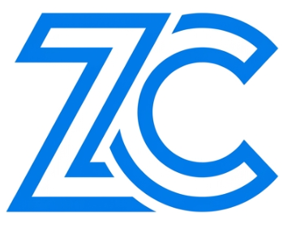

# Zivvo Chat



**Zivvo Chat** is an instant, secure, real-time video, audio, and text chat platform built with Next.js, WebRTC, Socket.IO, PostgreSQL, and Redis.

---

## Branding Assets

- **ZC Logo**: Located at [`public/logo.jpg`](./public/logo.jpg) – Minimalist blue **ZC** monogram vector logo.
- **Favicon**: Located at [`app/favicon.ico`](./app/favicon.ico) & [`public/favicon.jpg`](./public/favicon.jpg) – High-resolution ZC app favicon icon.

---

## Features

- **P2P Video & Voice Calling**: High-definition peer-to-peer streaming via WebRTC with adaptive bitrate logic.
- **Live Text Chat**: Real-time messaging with instant Socket.IO synchronization.
- **Fully Responsive UI**: Optimized layout across mobile, tablet, laptop, and desktop screen sizes (portrait & landscape).
- **Zivvo Echo Bot**: Built-in conversational testing bot with 30+ custom plain-text responses.
- **Secure Room Tokens**: Cryptographically secure 64-character room token keys.
- **Multi-Tier Persistence**: PostgreSQL with Drizzle ORM and Redis caching for session tracking and message history.

---

## Quick Start

### 1. Install Dependencies

```bash
npm install
```

### 2. Run Development Server

```bash
npm run dev
```

Open [http://localhost:3000](http://localhost:3000) in your browser.

### 3. Production Build & Start

```bash
npm run build
npm run start
```


## Database & Docker Tools

- **DBeaver CE**: Pre-configured database manager installed at `~/.local/opt/dbeaver` (`dbeaver` command).
- **Lazydocker**: Installed CLI GUI tool for Docker container management (`lazydocker` command).
